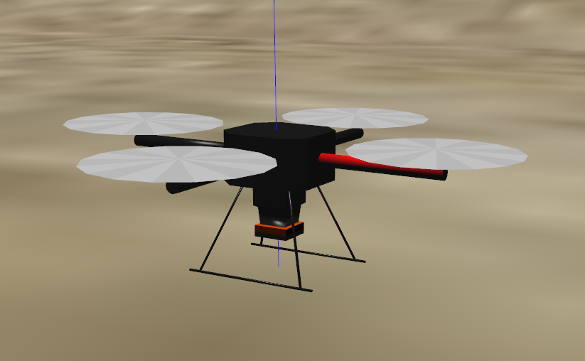
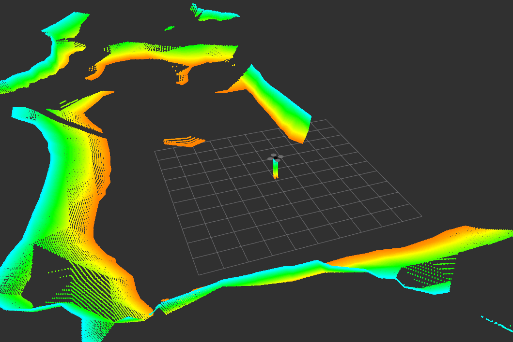
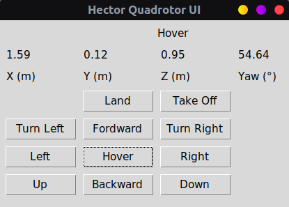

# hector_quadrotor ported to ROS Noetic & Gazebo 11

<p align="center">
     
</p>

***.:: First version, please tell me the issues or help me to fix it ::.***

I took part of this from __The Construct's__ [repo](https://bitbucket.org/theconstructcore/hector_quadrotor_sim/src/master/) and YouTube [chanel](https://www.youtube.com/channel/UCt6Lag-vv25fTX3e11mVY1Q).

## Requirements

I. You need the following packages before install `hector_quadrotor_noetic`.

* unique_identifier:
    ```sh
    git clone https://github.com/ros-geographic-info/unique_identifier.git
    ```
* geographic_info:
    ```sh
    git clone https://github.com/ros-geographic-info/geographic_info.git
    ```

II. Build.
```sh
cd ~/catkin_ws && catkin_make
```

III. Clone `hector_quadrotor_noetic`.
```sh
git clone https://github.com/RAFALAMAO/hector_quadrotor_noetic.git
```

IV. Repeat step II.

## Usage

Run a simulation by executing the launch file in `hector_quadrotor_gazebo` and `hector_quadrotor_demo` packages (only these work at the momment, but you can try other ones):

* Run the following for one drone inside an empty world:
    ```sh
    roslaunch hector_quadrotor_gazebo quadrotor_empty_world.launch
    ```
* Run the following for one dron outdoor:
    ```sh
    roslaunch hector_quadrotor_demo outdoor_flight_gazebo.launch
    ```
* Run the following for one dron outdoor without rviz interface:
    ```sh
    roslaunch hector_quadrotor_demo outdoor_flight_gazebo_no_rviz.launch
    ```
* Run the following for two drones inside an empty world:
    ```sh
    roslaunch hector_quadrotor_demo two_drones_empty.launch
    ```

## You can control it with:
* teleop_twist_keyboard.
    ```sh
    git clone https://github.com/ros-teleop/teleop_twist_keyboard
    ```
  **Note:** check use in: https://github.com/ros-teleop/teleop_twist_keyboard
* User interface, shared by my friend [__anderdefector__](https://github.com/anderdefector) and adapted by me. You can find the code in __hector_ui/src__ folder inside this repo.
    <br/>
    
    * Run the following for one dron ui:
        ```sh
        rosrun hector_ui ui_hector_quad.py
        ```
    * If you are working with `two_drones_empty.launch`.
        * Run the following for leader dron ui:
            ```sh
            rosrun hector_ui ui_hector_quad_leader.py
            ```
        * Run the following for follower dron ui:
            ```sh
            rosrun hector_ui ui_hector_quad_follower.py
            ```
    * __Note:__ `Land` and `Take Off` buttons don't work with `hector_quadrotor`.


## Test

Here is a [video](https://www.youtube.com/watch?v=-2IWfZjqoNc) testing it:

<p align="center">
    <a href="https://www.youtube.com/watch?v=-2IWfZjqoNc"></a>
</p>
